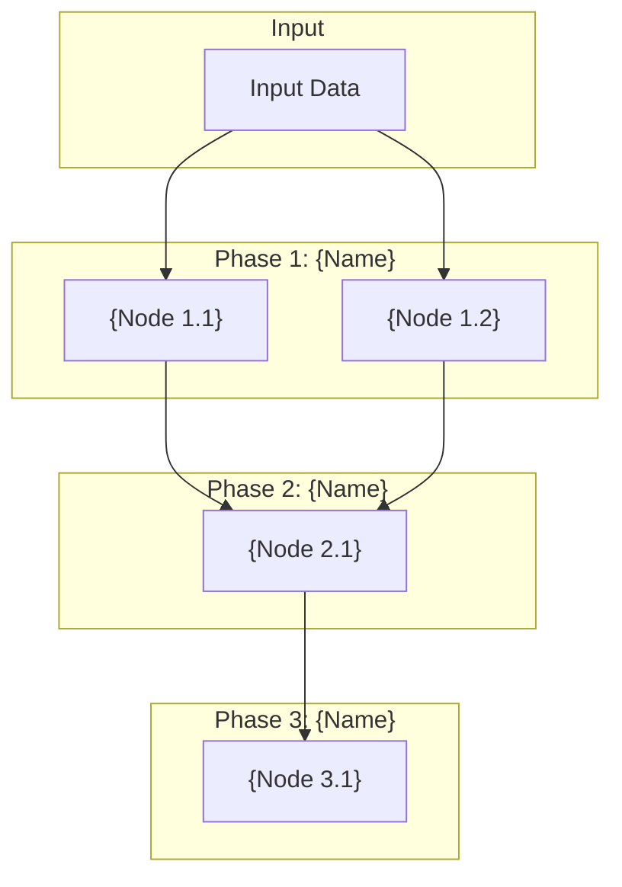

# Agent Scoping Document Template

**Purpose**: Complete this template BEFORE running the design-beam-agent skill. This document defines all inputs, outputs, processing logic, and node architecture for your Beam.ai agent.

---

## 1. Agent Overview

### 1.1 Agent Name
`{agent-name}` (lowercase-with-hyphens)

### 1.2 Purpose
{1-2 sentence description of what this agent does}

### 1.3 Key Constraints
- {Constraint 1: e.g., "Beam.ai nodes are prompt-only (no code execution)"}
- {Constraint 2: e.g., "Input is pre-parsed text, not raw images"}
- {Constraint 3}

---

## 2. Input Specification

### 2.1 Input Type
- **Format**: {text | JSON | structured data | file content}
- **Source**: {User input | API | Database | File upload}
- **Size**: {Approximate size/length}

### 2.2 Input Structure
Describe or show example of input structure:

```
{Example input or schema}
```

### 2.3 Input Fields
| Field | Type | Required | Description |
|-------|------|----------|-------------|
| {field_1} | {string/number/etc} | Yes/No | {What it contains} |
| {field_2} | | | |

---

## 3. Output Specification

### 3.1 Output Type
- **Format**: {JSON | Report | Structured data}
- **Destination**: {API response | File | Database}

### 3.2 Output Schema
```json
{
  "field_1": "<type, description>",
  "field_2": "<type, description>"
}
```

### 3.3 Output Requirements
- {Requirement 1: e.g., "Must include reasoning before conclusions"}
- {Requirement 2: e.g., "Human-readable report section required"}

---

## 4. Processing Rules

### 4.1 Rule Categories
List the categories of rules/logic this agent applies:

| Category | Rule Count | Description |
|----------|------------|-------------|
| {Category 1} | {N} | {What these rules do} |
| {Category 2} | {N} | |

### 4.2 Rule Definitions
For each rule, define:

#### {RULE-ID}: {Rule Name}
- **Severity**: {Critical | Warning | Info | Automatic}
- **Logic**: {What condition triggers this rule}
- **Action**: {What happens when triggered}
- **Policy Reference**: {Optional: source document/section}

*(Repeat for each rule)*

### 4.3 Severity Definitions
| Severity | Meaning | Action |
|----------|---------|--------|
| Critical | {Definition} | {What happens} |
| Warning | | |
| Info | | |
| Automatic | | |

---

## 5. External Dependencies

### 5.1 Required External Data
| Data Source | Purpose | Fallback if Unavailable |
|-------------|---------|------------------------|
| {System 1} | {Why needed} | {SKIP / NEEDS_REVIEW / default value} |
| {System 2} | | |

### 5.2 API Integrations
| API | Endpoint | Data Retrieved |
|-----|----------|----------------|
| {API 1} | {URL/path} | {What data} |

---

## 6. Node Architecture

### 6.1 Processing Phases
| Phase | Purpose | Node Count |
|-------|---------|------------|
| Phase 1: {Name} | {What this phase does} | {N} |
| Phase 2: {Name} | | |
| Phase 3: {Name} | | |

### 6.2 Node Inventory
| Node ID | Node Name | Type | Purpose |
|---------|-----------|------|---------|
| 1.1 | {Name} | Extraction | {Brief purpose} |
| 1.2 | {Name} | Extraction | |
| 2.1 | {Name} | Processing/Validation | |
| 3.1 | {Name} | Output | |

### 6.3 Data Flow


### 6.4 Node Dependencies
| Node | Depends On | Outputs To |
|------|------------|------------|
| 1.1 | Input | 2.1 |
| 1.2 | Input | 2.1 |
| 2.1 | 1.1, 1.2 | 3.1 |
| 3.1 | 2.1 | Final Output |

---

## 7. Field Mappings

### 7.1 Input → Processing Mappings
| Input Field | Used By | Purpose |
|-------------|---------|---------|
| {input.field_1} | Node 2.1 | {What validation/processing} |
| {input.field_2} | Node 2.2 | |

---

## 8. Example Processing

### 8.1 Sample Input
```
{Paste or describe a real example input}
```

### 8.2 Expected Node Outputs
| Node | Key Outputs |
|------|-------------|
| 1.1 | {What this node extracts/produces} |
| 2.1 | {What validations fire, expected results} |
| 3.1 | {Final output summary} |

---

## 9. Open Questions / Assumptions

1. **{Question 1}**: {Details}
   - *Assumption*: {How you're handling it}

2. **{Question 2}**: {Details}
   - *Assumption*: {How you're handling it}

---

## Checklist Before Running Skill

- [ ] Agent name defined (lowercase-with-hyphens)
- [ ] Input specification complete with example
- [ ] Output schema defined
- [ ] All processing rules listed with severities
- [ ] Node architecture designed with data flow
- [ ] At least one example input provided
- [ ] External dependencies identified with fallbacks

---

*Complete this template, then run: "design beam agent for {agent-name}"*
