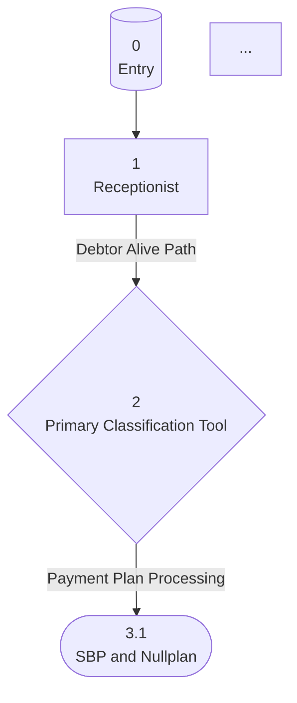

# Graph Slicer

Extract individual tools from a graphTools array into separate JSON files with topology-aware naming and automatic Mermaid flowchart generation.

## Purpose

This skill processes exported Beam.ai JSON files containing graph objects and:
1. **Extracts actual graph topology** - Uses BFS traversal of nodes and edges
2. **Creates level-based file naming** - Files numbered by depth (e.g., `3.1-ToolName.json` for level 3, branch 1)
3. **Generates Mermaid flowcharts** - Visual representation of the agent flow with routing conditions
4. **Enriches tool files with metadata** - Adds incoming/outgoing edges, conditions, error handling

## Workflow

### Step 1: Identify Input File

Locate the exported JSON file containing the graph structure. The file structure is typically:
```json
[{
  "agent": {...},
  "graph": {
    "nodes": [...],  // Graph topology with childEdges
    ...
  },
  "graphTools": [...],  // Tool definitions
  "sampleAgentTasks": [...]
}]
```

### Step 2: Ask User for Output Mode

**Ask the user:** "Which output mode would you like?"
- **markdown** (default) - Human-readable documentation
- **json** - Machine-readable enriched JSON with topology metadata

### Step 3: Ask User for Output Directory

**CRITICAL - ALWAYS ASK:** "Where should I create the nodes/ folder?"
- Default: Same directory as the input file
- User can specify a different path
- **NEVER assume or auto-create without asking!**

**Check for existing files:**
- If `nodes/` folder already exists at the target location, **STOP**
- Warn user: "⚠️ nodes/ folder already exists at [path]. Files may be overwritten!"
- Ask: "Continue and overwrite? (yes/no)"
- If "no" → Ask for a different output directory
- **NEVER auto-delete files!**

### Step 4: Run the Slicer

Based on user choices, run with the appropriate flags:

#### Markdown Mode (DEFAULT - Recommended)

Creates clean documentation for human reading:

```bash
node scripts/slice_graph.js <input-file> --markdown --output <output-dir>
```

**If user chose same directory as input file, omit --output flag:**
```bash
node scripts/slice_graph.js <input-file> --markdown
```

**Output in `nodes/` folder:**
- `GRAPH.md` - High-level overview with:
  - Agent description and statistics
  - Mermaid flowchart (color-coded nodes)
  - Topology summary (indented tree)
  - Node index with links
  - Routing conditions
- Individual node files: `1-Receptionist.md`, `2-Primary-Classification.md`, etc.
  - Level and branch info
  - Input parameters (listed first)
  - Prompt
  - Output parameters

**Example:**
```markdown
# 1 - Receptionist

**Level**: 1
**Branch**: 0

## Input Parameters

**document_text**: The full text content extracted from the PDF

## Prompt

Extract debtor information from the document...

## Output Parameters

**debtor_name**: Full name of the debtor
**debtor_status**: alive/deceased/unknown
```

#### JSON Mode

Creates enriched JSON with topology metadata:

```bash
node scripts/slice_graph.js <input-file> --json --output <output-dir>
```

**If user chose same directory as input file, omit --output flag:**
```bash
node scripts/slice_graph.js <input-file> --json
```

**Output in `nodes/` folder:**
- Individual JSON files: `1-Receptionist.json`, `2-Primary-Classification.json`, etc.
- Each file contains:
  - `_topology` metadata block (level, branch, edges, conditions)
  - Original tool data (prompt, params, config)

**Level numbering (both modes):**
- Level 0 = Entry node
- Level 1 = First processing step
- Level 3.2 = Third level, second branch
- Numbers reflect actual graph depth and branching

### Step 4: Review Generated Files

**Tool files include:**
- `_topology` metadata block with:
  - `level`, `branch`, `levelNumber`
  - `nodeId`, `objective`
  - `onError`, `evaluationCriteria`
  - `incomingEdges` (parent nodes + conditions)
  - `outgoingEdges` (child nodes + conditions)
  - `isExitNode` flag
  - Node timestamps

**GRAPH.md includes:**
- Agent metadata (ID, dates, description)
- Mermaid flowchart with:
  - Color-coded nodes (entry, exit, router, processor)
  - Edge labels showing routing conditions
  - Branch names
- Node details table
- Complete routing conditions with code blocks
- Statistics (total nodes, exit points, decision points, max depth)

## Example Output

### Topology Summary
```
0 - Entry Node (1 branches)
  1 - Receptionist (1 branches)
    2 - Primary Classification Tool (6 branches)
      3.1 - SBP and Nullplan [EXIT]
      3.2 - FOA [EXIT]
      3.3 - Schreiben Gericht [EXIT]
      3.4 - MRH [EXIT]
      3.5 - Restschuldbefreiung [EXIT]
      3.6 - Classification Schreiben InsoW [EXIT]
```

### Mermaid Flowchart (in GRAPH.md)


## Notes

**About JSON Structure:**
- Handles nested structures where data is under `data[0]` or `data['0']`
- Matches tools via `toolFunctionName` from node's `toolConfiguration`
- Preserves all original tool data while adding topology metadata
- Files are formatted with 2-space indentation for readability
- All files created in same directory as input file

**Graph Metadata Captured:**
- Node connections via `childEdges`
- Routing conditions (business logic)
- Edge names (human-readable labels)
- Error handling strategy per node
- Evaluation criteria
- Creation/update timestamps

**Use Cases:**
- Documenting agent architecture
- Understanding branching logic
- Reviewing routing conditions
- Onboarding new team members
- Debugging agent flow issues
