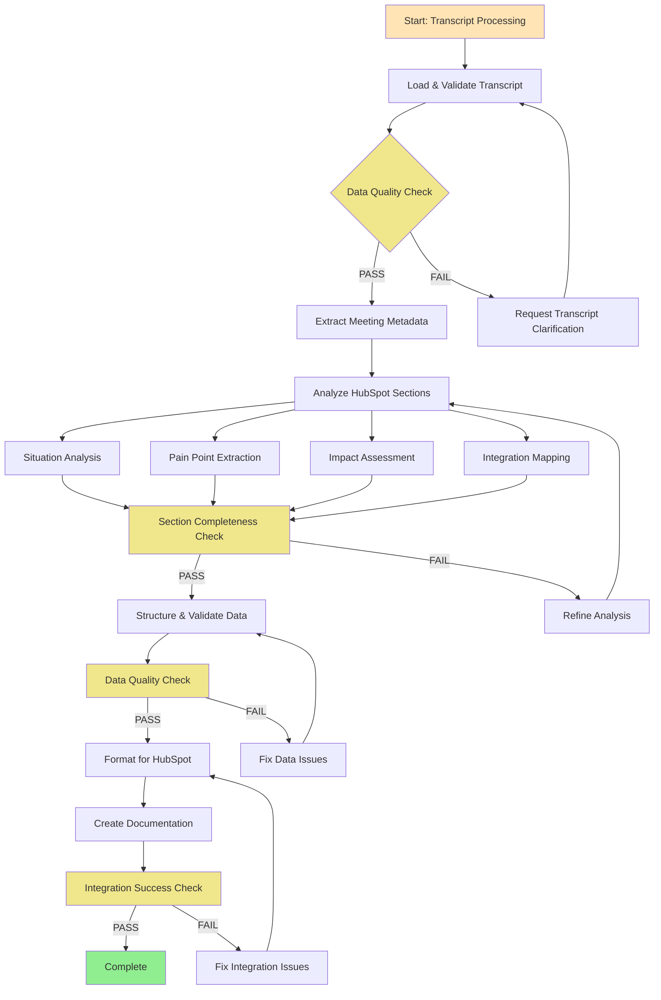

# Transcript to Business Sections Workflow
**Workflow ID**: transcript-to-business-sections  
**Category**: analysis  
**Priority**: HIGH  
**Type**: Sequential with quality gates  

## Purpose
Process sales meeting transcripts and automatically extract structured information into four key business sections: Situation, Pain, Impact, and Integrations. This workflow transforms raw conversation data into organized text summaries for better analysis and follow-up strategies.

## When to Use
- After discovery calls, demo calls, or client meetings
- When you need to systematically capture business intelligence from conversations
- For consistent analysis and documentation of meeting insights
- When preparing for follow-up communications or proposal development

## Workflow Overview
This workflow processes raw meeting transcripts into structured business intelligence, categorizing information into four key business sections while maintaining context and relationships between different data points.

## Pre-Workflow Checklist
- [ ] Verify transcript file availability and quality
- [ ] Confirm meeting metadata (participants, date, company context)
- [ ] Prepare company folder structure in `Companies/{Company-Name}/`
- [ ] Schedule processing time (5-8 minutes)

## Workflow Stages

### Stage 1: Transcript Ingestion & Initial Analysis (2-3 minutes)
**Agent**: transcript-processor  
**Tasks**:
- Load transcript file and validate format
- Extract meeting metadata (participants, date, duration, context)
- Perform initial entity extraction (names, companies, roles)
- Classify meeting type and business context
- Identify language and communication patterns

**Quality Gate**: Data Validation
- [ ] Transcript file successfully loaded and parsed
- [ ] All participants identified with roles
- [ ] Meeting context clearly established
- [ ] No critical data extraction errors

**Deliverables**:
- Structured meeting metadata
- Participant profiles with roles
- Meeting context classification
- Initial entity extraction results

### Stage 2: Business Section Analysis (2-3 minutes)
**Agent**: business-intelligence-analyst  
**Tasks**:
- Analyze transcript for Situation context (company background, current state, business environment)
- Extract Pain points (challenges, frustrations, inefficiencies, problems)
- Identify Impact factors (business consequences, costs, risks, opportunities)
- Map Integration requirements (technical needs, system connections, compatibility)

**Quality Gate**: Section Completeness
- [ ] Situation section captures company context and current state
- [ ] Pain points are specific and actionable
- [ ] Impact factors include quantifiable business consequences
- [ ] Integration requirements are technically feasible

**Deliverables**:
- Situation analysis with company context
- Pain point identification and categorization
- Impact assessment with business consequences
- Integration requirements mapping

### Stage 3: Text Summary Generation (2-3 minutes)
**Agent**: text-summarizer  
**Tasks**:
- Generate comprehensive text summaries for each section
- Structure information into readable, actionable format
- Validate data consistency across sections
- Cross-reference information for accuracy
- Create summary insights and recommendations

**Quality Gate**: Summary Quality
- [ ] All sections contain relevant, accurate information
- [ ] Text summaries are clear and actionable
- [ ] Cross-references between sections are consistent
- [ ] Summary insights are comprehensive

**Deliverables**:
- Structured text summaries for each section
- Data validation report
- Cross-section consistency analysis
- Summary insights and recommendations

### Stage 4: Documentation & Follow-up (1-2 minutes)
**Agent**: documentation-specialist  
**Tasks**:
- Create company folder documentation
- Generate follow-up action items
- Create processing summary report
- Organize output files for easy access

**Quality Gate**: Documentation Complete
- [ ] All text summaries properly formatted
- [ ] Company documentation properly organized
- [ ] Follow-up actions clearly defined
- [ ] Processing summary complete

**Deliverables**:
- Text summary files for each section
- Company folder documentation
- Follow-up action plan
- Processing summary report

## Business Section Definitions

### Situation
**Purpose**: Capture the company's current business context and environment
**Content**:
- Company background and industry
- Current business model and operations
- Market position and competitive landscape
- Recent changes or developments
- Business objectives and goals
- Team structure and decision-making process

**Extraction Guidelines**:
- Look for company description statements
- Identify industry and market context
- Note organizational structure mentions
- Capture business model discussions
- Record strategic objectives

### Pain
**Purpose**: Identify specific challenges, frustrations, and problems
**Content**:
- Operational inefficiencies
- Process bottlenecks and delays
- Cost concerns and budget constraints
- Technology limitations
- Resource constraints
- Competitive pressures
- Customer satisfaction issues

**Extraction Guidelines**:
- Listen for problem statements and frustrations
- Identify recurring challenges
- Note cost and efficiency concerns
- Capture technology pain points
- Record process inefficiencies

### Impact
**Purpose**: Quantify business consequences and opportunities
**Content**:
- Financial impact (costs, revenue loss, savings potential)
- Operational impact (time savings, efficiency gains)
- Strategic impact (competitive advantage, market position)
- Risk factors and consequences
- Opportunity costs
- Success metrics and KPIs

**Extraction Guidelines**:
- Look for quantified business impact
- Identify success metrics and KPIs
- Note risk factors and consequences
- Capture opportunity discussions
- Record performance indicators

### Integrations
**Purpose**: Map technical requirements and system connections
**Content**:
- Current technology stack
- Required system integrations
- Data flow requirements
- API and connectivity needs
- Security and compliance requirements
- Implementation constraints
- Technical dependencies

**Extraction Guidelines**:
- Identify current systems and tools
- Note integration requirements
- Capture technical constraints
- Record data flow needs
- Document security requirements

## Workflow Configuration

```yaml
workflow:
  type: sequential
  allow_skip: false
  require_gates: true
  estimated_duration: "5-8 minutes"
  
quality_gates:
  - gate: "data_validation"
    trigger: "after transcript ingestion"
    criteria:
      - "Transcript successfully parsed"
      - "All participants identified"
      - "Meeting context established"
    validation_method: "PASS/CONCERNS/FAIL/WAIVED"
    
  - gate: "section_completeness"
    trigger: "after business analysis"
    criteria:
      - "All four sections populated"
      - "Information is specific and actionable"
      - "Business context is clear"
    validation_method: "PASS/CONCERNS/FAIL/WAIVED"
    
  - gate: "summary_quality"
    trigger: "after text generation"
    criteria:
      - "Text summaries are clear and comprehensive"
      - "Data consistency validated"
      - "Cross-references accurate"
    validation_method: "PASS/CONCERNS/FAIL/WAIVED"
    
  - gate: "documentation_complete"
    trigger: "after documentation"
    criteria:
      - "All text summaries properly formatted"
      - "Documentation complete"
      - "Follow-up actions defined"
    validation_method: "PASS/CONCERNS/FAIL/WAIVED"
```

## Output Structure

### Company Folder Organization
```
Companies/{Company-Name}/
├── transcripts/
│   ├── raw/
│   │   └── {meeting-name}.txt
│   └── processed/
│       ├── business-sections.md
│       ├── analysis-summary.md
│       └── processing-report.md
├── sections/
│   ├── situation.md
│   ├── pain-points.md
│   ├── impact-analysis.md
│   └── integration-requirements.md
└── follow-up/
    ├── action-items.md
    └── next-steps.md
```

### Business Sections Output Format
```markdown
# Business Sections Summary
**Company**: Company Name  
**Meeting Date**: YYYY-MM-DD  
**Meeting Type**: discovery|demo|follow-up  
**Participants**: [List of participants with roles]

## Situation
[Comprehensive text summary covering:]
- Company background and industry context
- Current business model and operations
- Market position and competitive landscape
- Recent developments and changes
- Organizational structure and decision-making
- Business objectives and strategic goals

## Pain Points
[Detailed analysis of challenges including:]
- Operational inefficiencies and bottlenecks
- Process delays and cost concerns
- Technology limitations and constraints
- Resource constraints and competitive pressures
- Customer satisfaction issues
- Specific frustrations and problems mentioned

## Impact
[Business consequences and opportunities including:]
- Financial impact (costs, revenue loss, savings potential)
- Operational impact (time savings, efficiency gains)
- Strategic impact (competitive advantage, market position)
- Risk factors and potential consequences
- Success metrics and KPIs discussed
- Opportunity costs and missed potential

## Integrations
[Technical requirements and system connections including:]
- Current technology stack and tools
- Required system integrations and connections
- Data flow requirements and API needs
- Security and compliance requirements
- Implementation constraints and dependencies
- Technical feasibility and compatibility

## Key Insights
- Most critical opportunities identified
- Competitive advantages and differentiators
- Implementation priorities and next steps
- Risk mitigation strategies
- Success factors and metrics

## Follow-up Actions
### Immediate (Next 24 hours)
- [Action items with owners and deadlines]

### Short-term (Next week)
- [Action items with owners and deadlines]

### Long-term (Next month)
- [Action items with owners and deadlines]
```

## Success Metrics
- **Processing Speed**: Complete analysis in <8 minutes
- **Data Accuracy**: 95%+ accuracy for section categorization
- **Completeness**: All four sections populated with relevant data
- **Actionability**: 90%+ of extracted information is actionable
- **Summary Quality**: Clear, comprehensive text summaries

## Integration Points
- **Transcript Sources**: Various meeting recording platforms
- **Company Folders**: Standardized `Companies/{name}/` structure
- **Text Processing**: LLM-powered analysis and summarization
- **Documentation**: Analysis reports and summaries
- **Follow-up Systems**: Action item tracking and management

## Tools and Resources
- **LLM Processing**: OpenAI/Claude for transcript analysis and text generation
- **File System**: Company folder organization
- **Text Processing**: Markdown formatting and structure
- **Validation Tools**: Data quality and consistency checks
- **Reporting**: Processing summaries and insights

## Risk Mitigation
- **Transcript Quality**: Manual review for poor audio quality
- **Data Privacy**: Local processing, no cloud storage of sensitive data
- **Accuracy Validation**: Multi-stage quality gates and validation
- **Summary Quality**: Comprehensive review and validation protocols

## Decision Points

### Complexity Assessment
**Simple Path** (Standard discovery calls):
- Single decision maker
- Clear business context
- Straightforward requirements
- Standard processing workflow

**Complex Path** (Multi-stakeholder, technical discussions):
- Multiple decision makers
- Complex technical requirements
- Multiple integration points
- Extended analysis and validation

### Data Quality Issues
**Minor Issues** (Missing details):
- Continue with available data
- Flag missing information
- Include in follow-up actions

**Major Issues** (Incomplete transcript):
- Request transcript clarification
- Pause workflow until resolved
- Document quality concerns

## Post-Workflow Actions

### Immediate Actions (Next 24 hours)
- [ ] Review extracted sections for accuracy
- [ ] Send follow-up communications based on insights
- [ ] Schedule next meeting based on action items
- [ ] Share summaries with relevant team members

### Follow-up Actions (Next Week)
- [ ] Monitor lead progression based on insights
- [ ] Refine competitive positioning
- [ ] Update deal strategy based on pain points
- [ ] Document learnings for future meetings

## Implementation Notes
- **Last Updated**: 2025-01-27
- **Created By**: System
- **Status**: Active
- **Next Review**: 2025-02-27
- **Version**: 1.0.0

## Flow Diagram



## Usage Instructions

### Workflow Execution
1. **Prepare**: Ensure transcript file is available and company folder exists
2. **Initialize**: Load workflow with meeting context and participant information
3. **Execute**: Run through all stages with quality gate validation
4. **Validate**: Review extracted sections for accuracy and completeness
5. **Generate**: Create comprehensive text summaries for each section
6. **Document**: Save processing results and insights for future reference

### Quality Assurance
- Always validate transcript quality before processing
- Use quality gates to ensure data accuracy
- Cross-reference information across sections
- Validate text summary quality and completeness
- Document any data quality issues or concerns

### Best Practices
- Process transcripts within 24 hours of meeting
- Maintain consistent company folder structure
- Use standardized section definitions
- Validate all extracted information
- Create actionable follow-up items
- Document insights for future reference
